# Hardware setup
A useful way to use midi-panel-meter is running on a Raspberry Pi with an led panel.
The following instructions describe how I set it up, which worked successfully for me but otherwise comes with no guarentees or support.

## Parts required
- [Raspberry Pi 2-0w](https://core-electronics.com.au/raspberry-pi-zero-2-w-wireless.html) (wireless is not nessesary, but helps with setup & configuration)
- [32x16 RGB LED Matrix Panel](https://core-electronics.com.au/32x16-rgb-led-matrix-panel-6mm-pitch.html)
- [Micro USB Cable Male Host to USB OTG](https://www.ebay.com.au/itm/292254916725)
- [Micro USB 2.0 Female To Dual 2 Male Splitter Y](https://www.ebay.com.au/itm/384792640528)
- 16GB+ microSD card ([for example](https://www.jaycar.com.au/32gb-micro-sdxc-class-10-reads-90mb-s-writes-30mb-s/p/XC5016))
- PSU (5V 2A) and USB micro cable
- USB cable to connect to MIDI keyboard as required
- Superglue
- [3d printed base](Pi-meter_base_v4.stl)
- 4x m2.5x4 screws (I used m2.5x5 but I think shorter would have been better)
- 6x m3x16 screws
- (optional) 5V 2A label

## SD card setup
1. On another computer with a microSD card reader, install [Raspberry Pi Imager](https://www.raspberrypi.com/software/)
2. Insert microSD card into reader and run Raspberry Pi Imager
3. Follow instructions to flash microSD card with the following details:
- Raspberry Pi OS (64 bit) Lite (No Desktop)
- Enable SSH
- Set hostname, username (pi) and password
- Set WiFi & timezone details
- Add WiFi configuration of your home network (so you can configure it remotely)

## Assembly instructions
1. Led panel wiring as per: https://github.com/hzeller/rpi-rgb-led-matrix/blob/master/wiring.md
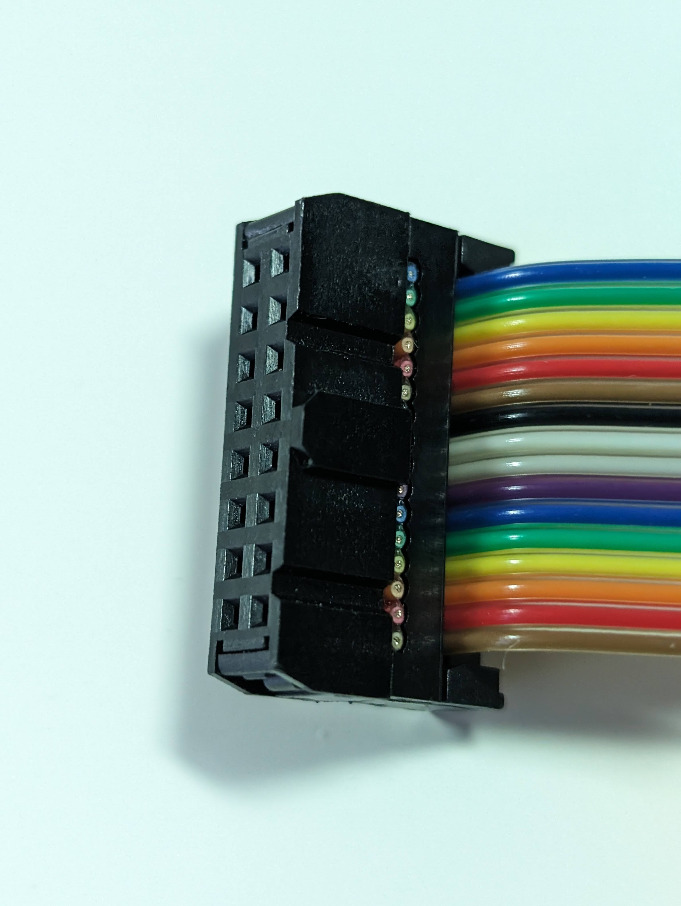
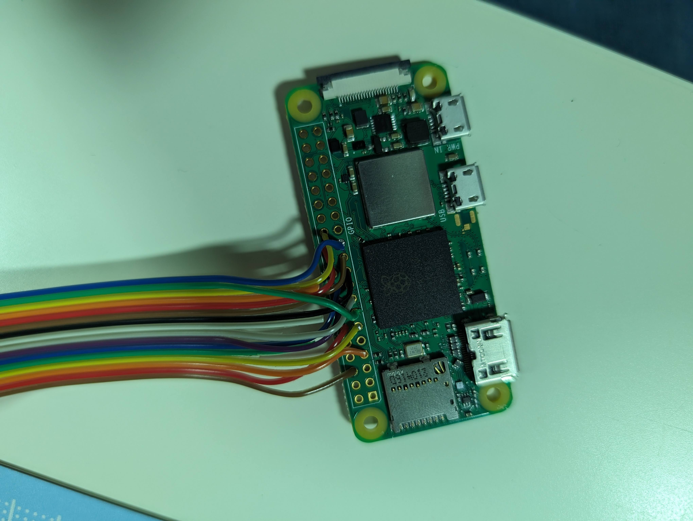
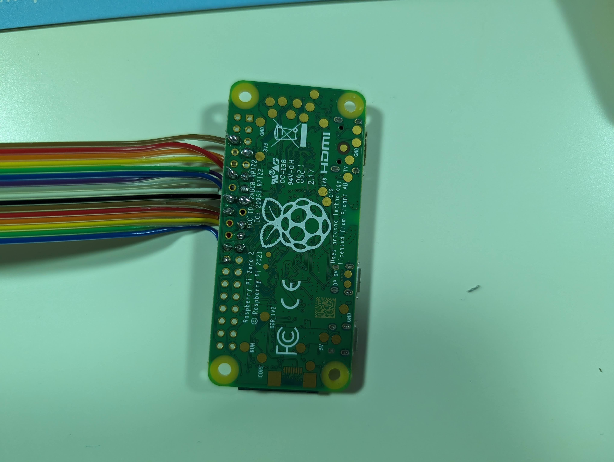
2. Cut one of the 2 plugs off the usb micro Y splitter, and solder to panel wires (heatshrink and electrical tape recommended)
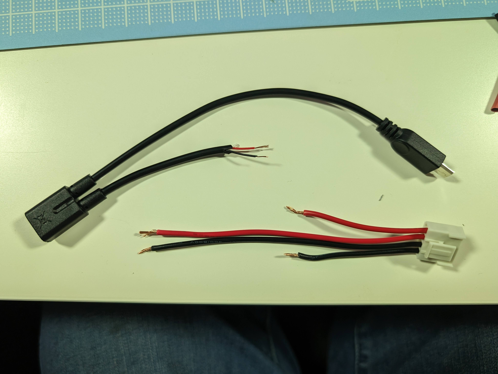
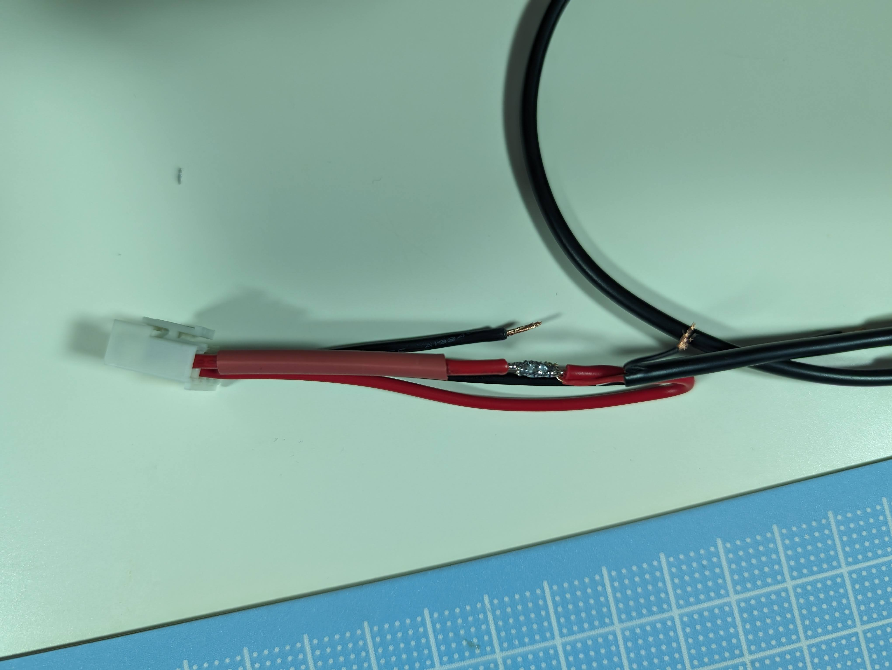
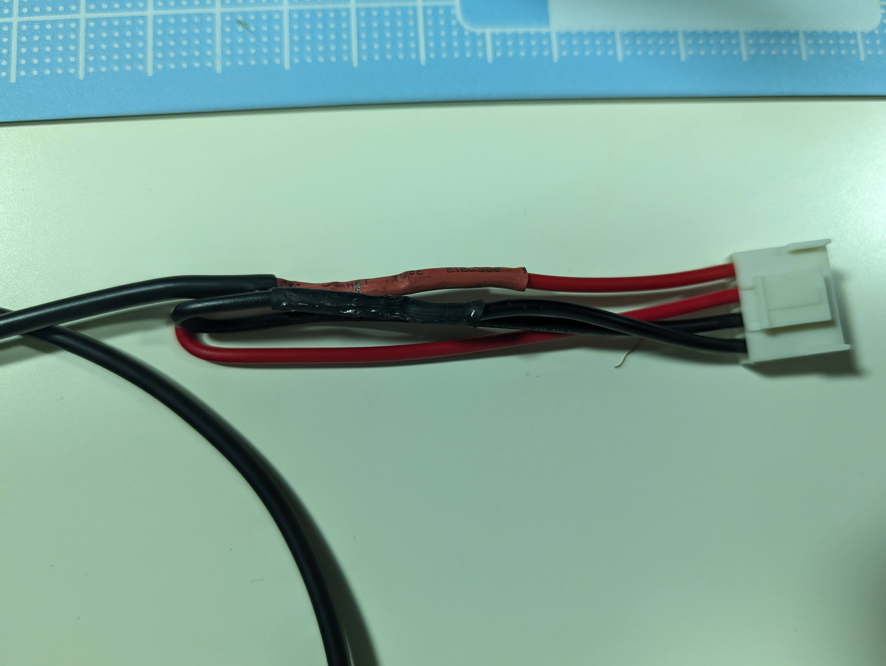
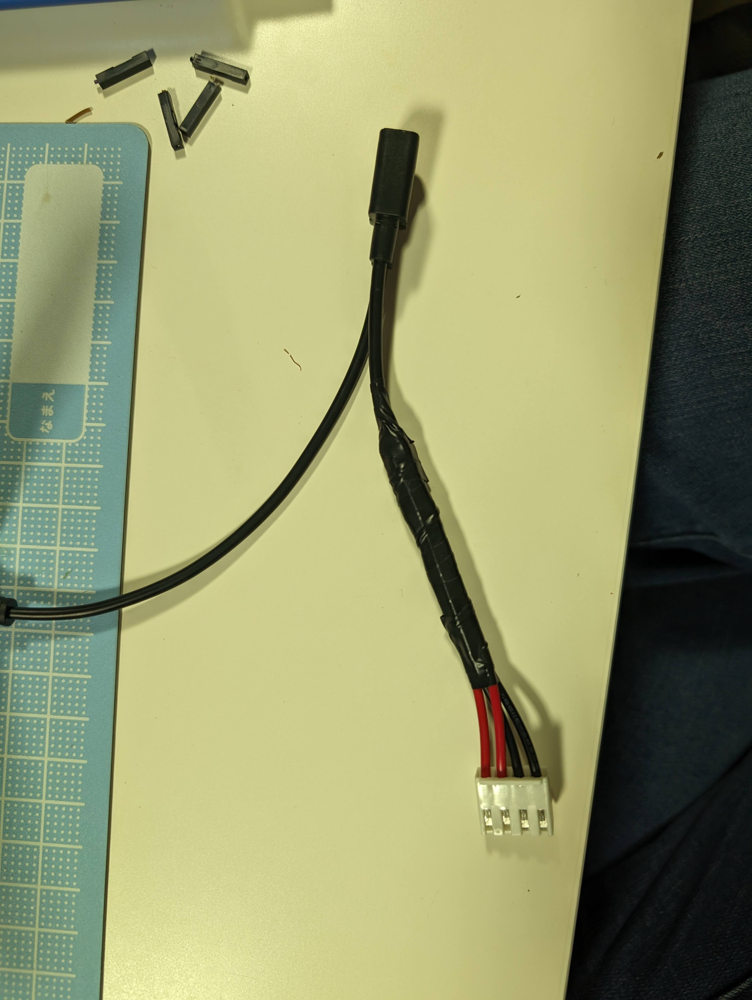
3. Insert SD card into RPi
4. Use 4x m2.5x4 screws to screw RPi into base
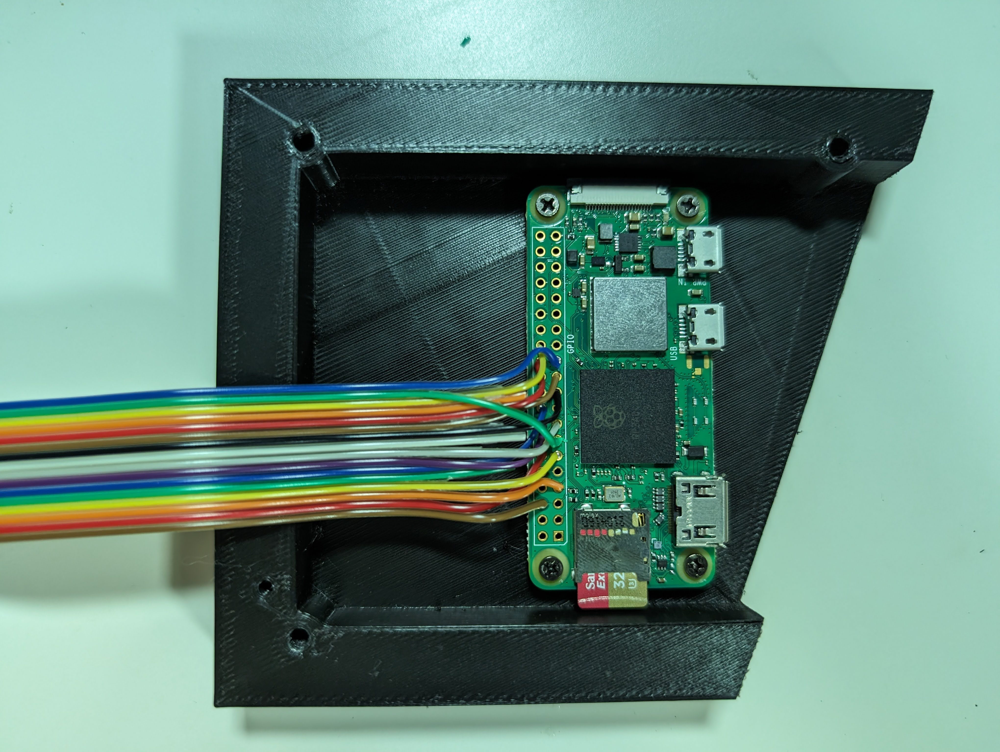
5. Superglue usb ports into base
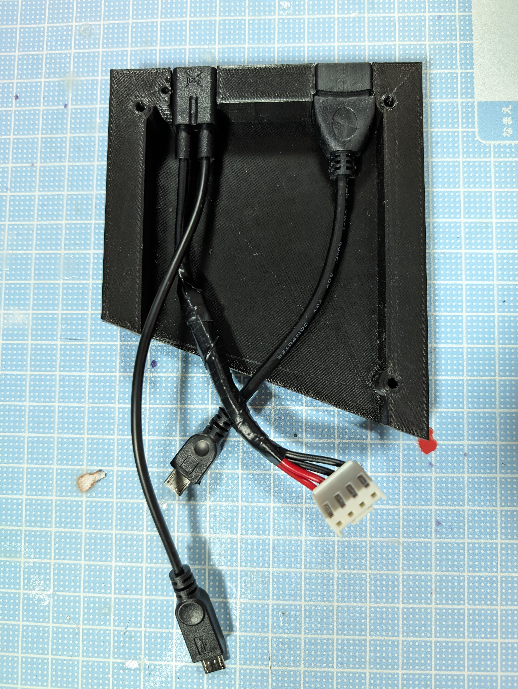
6. Connect 2x micro usb to RPi (usb-A -> data, usb-micro -> power) and ribbon cable & power to panel
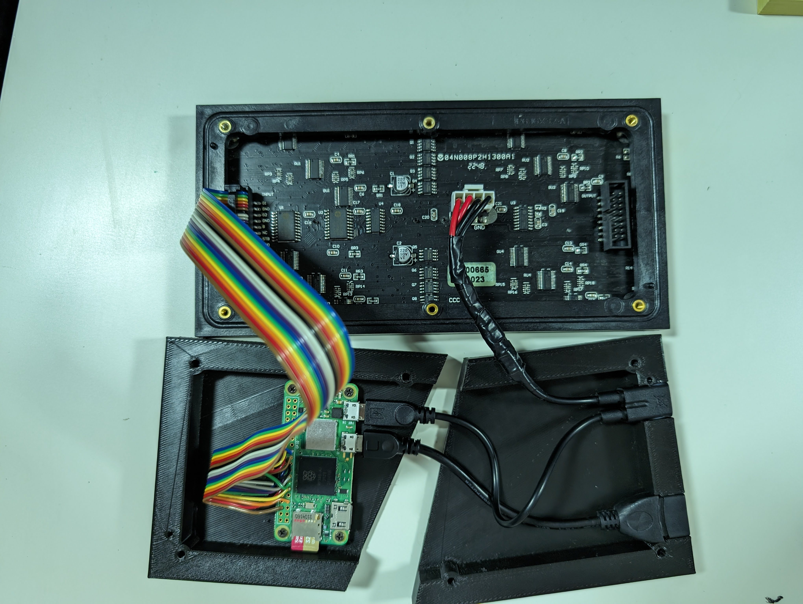
7. Use 6x m3x16 screws to screw base to panel
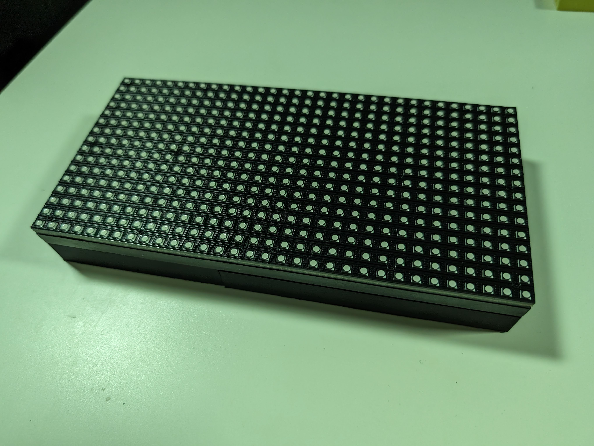
8. (optional) Stick 5V 2A label to base
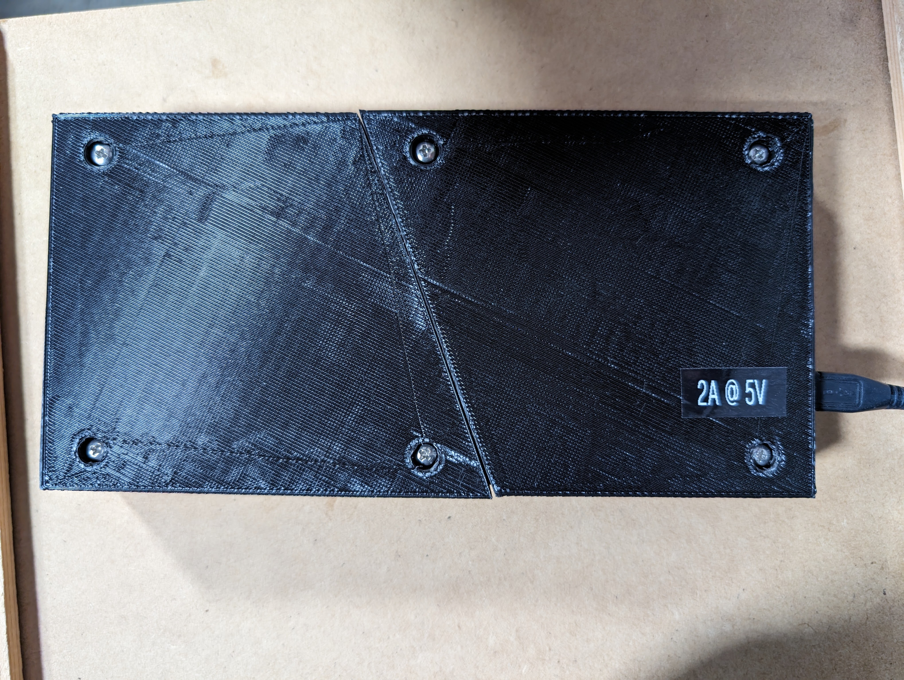
9. Plug in PSU, USB keyboard and turn Raspberry Pi on
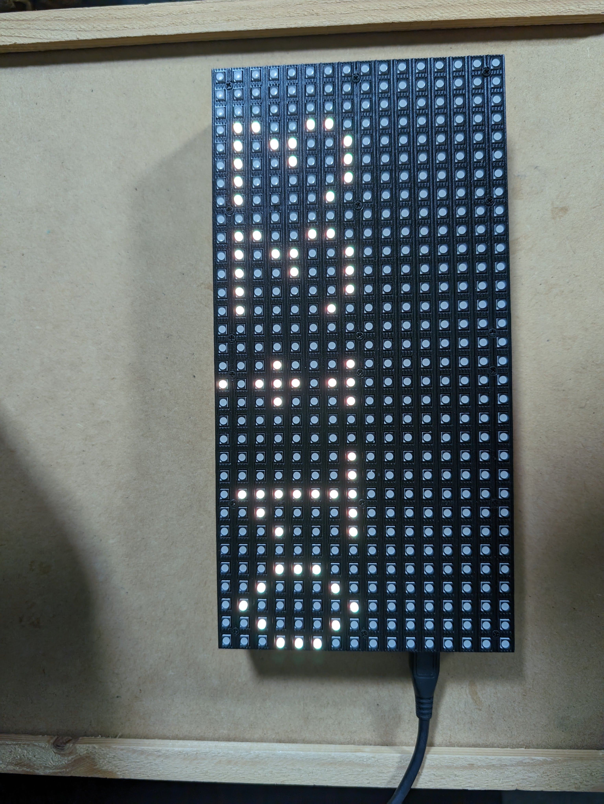

## Software configuration
1. Once the Raspberry Pi has turned on and booted up, it should connect to the WiFi network you configured above, confirm this using `ping HOSTNAME`
2. Use Putty or SSH in terminal to SSH into the raspberry pi using the username and password you configured above
3. Increase swap so that [rust will install](https://gist.github.com/tstellanova/0a6d8a70acc58a0d5be13ebaa7c935d4?permalink_comment_id=4647130#gistcomment-4647130)
- `sudo dphys-swapfile swapoff`
- `sudo nano /etc/dphys-swapfile`
- Change CONF_SWAPSIZE=100 to CONF_SWAPSIZE=512
- Save & exit
- `sudo dphys-swapfile setup`
- `sudo dphys-swapfile swapon`
4. Install rust `curl https://sh.rustup.rs -sSf | sh`
5. Configure other WiFi networks if required `sudo nano /etc/wpa_supplicant/wpa_supplicant.conf`
6. Disable sound (because it breaks the LED driver)
- `sudo nano /boot/config.txt`
- Remove: dtparam=audio=on
- Add: dtparam=audio=off
- Save & exit
- `sudo nano /boot/cmdline.txt`
- Add:  isolcpus=3
- Save & exit
- Run this:
```
cat <<EOF | sudo tee /etc/modprobe.d/blacklist-rgb-matrix.conf
blacklist snd_bcm2835
EOF
```
- `sudo update-initramfs -u`
- `sudo reboot`
7. Reconnect to SSH
8. Install git `sudo apt update && sudo apt upgrade && sudo install git`
9. Test hardware with LED driver
- `git clone https://github.com/hzeller/rpi-rgb-led-matrix.git`
- `cd rpi-rgb-led-matrix`
- `make -C examples-api-use`
- `sudo examples-api-use/demo -D0`
- `cd ~`
10. Download code `git clone https://github.com/davidlang42/midi-panel-meter.git`
11. Build code `cd midi-arpeggiator && cargo build --release`
12. Fix permission issue with sudo `sudo groupmod -aU root audio`
13. Make a startup script:
- `nano ~/run_on_startup`
- Type this into nano:
```
#!/usr/bin/bash
cd /home/pi/midi-panel-meter # must be in this dir to find 6x9.bdf
sudo ./target/release/midi-panel-meter # sudo to enable raw memory access for the led driver
```
- Ctrl+X to exit nano (and save)
- `chmod a+x ~/run_on_startup`
14. Make auto shutdown if overheat script"
- `nano ~/shutdown_on_temp`
- Type this into nano:
```
#!/usr/bin/bash
set -e
MAX="80"
while [ true ]
do
    SENSOR="`vcgencmd measure_temp | cut -d "=" -f2 | cut -d "'" -f1`"
    TEMP="`printf "%.0f\n" ${SENSOR}`"
    if [ "${TEMP}" -gt "${MAX}" ]
    then
        /usr/bin/logger "Shutting down due to cpu temp ${TEMP}."
        sudo shutdown -h now
    fi
    sleep 60
done
```
- Ctrl+X to exit nano (and save)
- `chmod a+x ~/shutdown_on_temp`
15. Make the scripts run on startup:
- `sudo nano /etc/rc.local`
- Append these lines before the last line:
```
/home/pi/run_on_startup &
/home/pi/shutdown_on_temp &
```
- Ctrl+X to exit nano (and save)
16. Reboot to make the panel meter run `sudo reboot`
17. Enjoy your Raspberry Pi MIDI panel meter!
- If you have any suggested improvements, raise an [issue](https://github.com/davidlang42/midi-panel-meter/issues) or submit a [pull request](https://github.com/davidlang42/midi-panel-meter/pulls)
- If you find this useful, consider [buying me a coffee](https://ko-fi.com/davidlang42)
